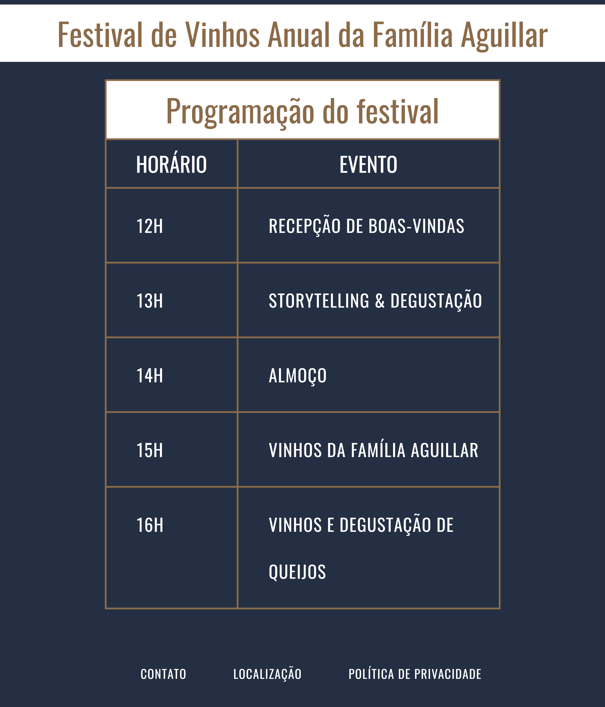

# Site Festival de Vinhos

## Descrição

Página simples criada para exibir a programação de um festival de vinhos

## O que foi utilizado?

HTML e VS Code.

<em>Obs: o documento possui páginas em .css que não foram escritas por mim pois até o momento de término deste documento eu não tinha conhecimento necessário em CSS.</em>

## Referências

Essa página foi criada com base no <a href="https://www.codecademy.com/courses/learn-html/projects/html-wine-festival-schedule" target="_blank"><em>projeto de estudo do curso de HTML da Codecademy</em></a>

## Imagens

